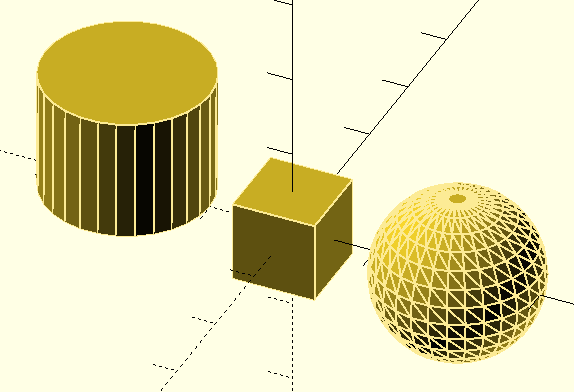
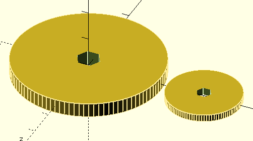
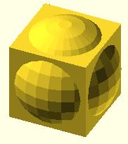
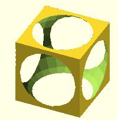
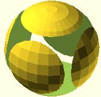
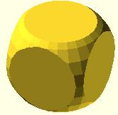
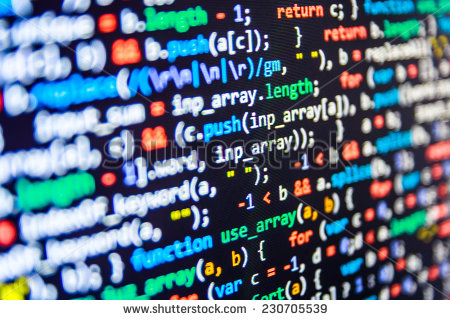

## [OpenScad](http://www.openscad.org/) 

Es un programa [Open-Source](https://es.wikipedia.org/wiki/C%C3%B3digo_abierto) de diseño 3D orientado a la generación algorítmica de objetos 3D, es decir crearemos los objetos por medio de un programa.

Los objetos se podrán imprimir directamente mediante el hardware adecuado.

Con esto queremos decir que tenemos que proporcionar a OpenScad todos los pasos necesarios para crear el objeto.

Existen otros programas que nos permiten diseñar objetos 3D.

Una de las principales ventajas de OpenScad es que podremos crear diseños por medio de otros programas que generar las instrucciones para crear estos objetos.

También es más sencillo el hacer labores repetivas.

* * *
## Escribiendo la receta ...

Es como si escribiéramos una receta para que cualquier otra persona creara ese objeto desde cero:

Veamos un ejemplo:

1. Comienza con un cubo de estas medidas

2. Pega en esta posición exacta una esfera

3. Añade un cilindro más pequeño de estas dimensiones en la posición x,y,x pero girado estos ángulos

4. Ahora haz un agujero (de estas medidas) en este punto.

5. ....

* * * 
## Detallando

A medida que revisamos nuestra receta, porque  queremos compartirla con alguien vemos que nuestra ha de ser más precisa:

* Debemos dar las posiciones y tamaños de los objetos. Eso lo haremos concretando las coordenadas exactas y las dimensiones (como estamos diseñando en 3D necesitamos 3 datos para especificar cada uno de ellos). **Necesitamos las medidas**

* También es muy importante el dar las instrucciones en el orden adecuado. **Necesitamos ordenar las instrucciones**

* Para que todo el mundo pueda hacer nuestra receta debemos usar un lenguaje que todo el mundo entienda, evitando que se puedan escapar detalles y explicando los pasos. **Necesitamos hablar un idioma universal**

* * *
## Formas básicas

Para diseñar nuestros objetos partimos de una serie de objetos básicos en los que podremos basarnos para generar objetos más complejos.

La forma en la generamos los nuevos objetos nos va a permitir reutilizarlos en la creación de otros aún más complejos.

#### Paramétrico

Una de las ventajas de OpenScad es que nos permite generar objetos paramétricos. Esto quiere decir que podemos personalizar el resultado según los valores que demos a estos parámetros.

Por ejemplo a partir del diseño de una rueda, si hemos incluido como parámetros su radio total, el grosor de la goma, el diámetro del eje, podremos generar distintas ruedas.

  

* * *

## Operaciones sobre objetos

Existen muchos tipos de operaciones que podemos aplicar a estos objetos 

Sobre un objeto podemos aplicar operaciones como la rotación (rotate), la translación (translate) o el cambio de color (color)

Las operaciones se aplicarán desde el más cercano al objeto al mas lejano, dejando siempre al final el objeto. Así el primer operador que indicamos es el último que se aplica.

Se suele indentar, dejando el objeto (que será el último) como la línea más interna

	color("blue")
		rotate([0,0,45])
			translate([40,0,0])
				rueda_simple(diametro/2,altura/2,diam_eje=5);

El signo ";" indica "la creación" del objeto y por tanto el fin de la sentencia.

El conjunto de objetos sobre los que se aplica se indica incluyendo éstos dentro de una llaves.

### Operadores booleanos

Se denominan así porque se aplican siguiente las leyes de la lógica.

#### Suma (union)

Unimos todos los objetos de la lista en un nuevo objeto.

Es la operación más intuita.

	union()
	{
	    cube([10,10,10],center=true);
	    sphere(r=6,center=true);
	}

#### Diferencia (difference), 

Se aplica a un conjunto de objetos restando del primero los siguientes y por el orden indicado.  

	difference()
	{
	    cube([10,10,10],center=true);
	    sphere(r=6,center=true);
	}

En la diferencia es muy importante el orden. Veamos un ejemplo

	difference()
	{
	    sphere(r=6,center=true);
	    cube([10,10,10],center=true);
	}

#### La intersección

Produce como resultado el la parte que es común a todos los objetos sobre los que se aplica.

	intersection()
	{
	    cube([10,10,10],center=true);
	    sphere(r=6,center=true);
	}

* * *

#Combinando operadores

Todos estos operadores se pueden combinar encadenándose las operaciones para dar lugar al objeto final

Veamos un ejemplo de una rueda con eje y refuerzo para sujetar el eje:

	// vamos a hacer una rueda con eje hexagonal

	diametro=50;
	altura=5;

	rueda_simple( diametro, altura);

	translate([40,0,0])
	rueda_simple(diametro/2,altura/2,diam_eje=5);

	module rueda_simple( diametro, altura,diam_eje=8)
	{
	    difference()
	    {
	        union()
	        {
	            // rueda
	            cylinder(d=diametro,h=altura,center=true,$fn=100);
	            // refuerzo para el eje
	            cylinder(d=diam_eje*2,h=2*altura,center=true,$fn=100);
	        }
	        // taladro eje
	        cylinder(d=diam_eje,h=3*altura,center=true,$fn=6);
	    }
	    
	}

* * *

Algunas normas sobre programación:

* Nuestro programa ha de ser claro

* Comentado, explicando lo que hacemos

* Debemos intentar hacerlo reutilizable

* * *

## Créditos y dónde aprender más sobre el tema

* Imágenes y algunos ejemplos de ["OpenScad User Book"](https://en.wikibooks.org/wiki/OpenSCAD_User_Manual/Print_version)

* Aprendizaje OpenScad microtutoriales de Obijuan [temporada I](https://www.youtube.com/playlist?list=PL2CED4B0A8EA522CF) y [temporada 2](https://www.youtube.com/playlist?list=PLmnz0JqIMEzXipVqksIcvWfskeEiWFw66)

* Filosofía opensource [Oficina Software Libre UGR](http://osl.ugr.es)

* Imágenes de [pixabay](https://pixabay.com)